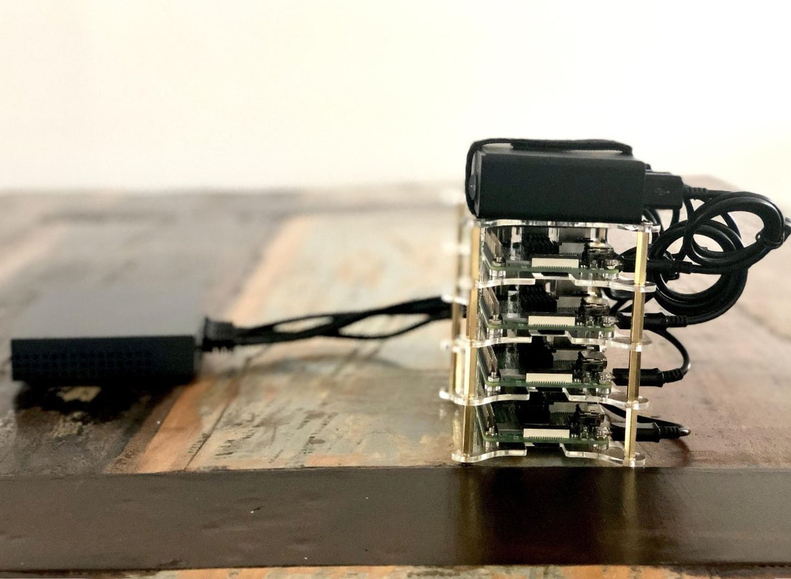

# Introduction

* I want to create a kubernetes cluster using k3s on multiple `Raspberry Pi 3 Model B+`: 1 master and 3 workers.
* k3s doesn't support master HA for now: https://github.com/rancher/k3s#server-ha
* The `init.sh` script has only been tested on MacOS but should be OK on Linux.
* I live in Canada so all the hardware can be bought from there.

# Hardware

* Raspberry Pi 3 Model B+:
    * https://www.buyapi.ca/
    * https://www.canakit.com/

* Heatsink Cooler:
    * https://www.amazon.ca/dp/B010ER7UN8/ref=pe_3034960_236394800_TE_dp_5

* Switch:
    * https://www.amazon.ca/dp/B00A121WN6/ref=cm_sw_em_r_mt_dp_U_KerOCbHFS5XZ8

* Case:
    * https://www.amazon.ca/ILS-Clear-Acrylic-Cluster-Raspberry/dp/B0768DDTKD

* USB HUB:
    * https://www.amazon.ca/dp/B00YRYS4T4/ref=pe_3034960_236394800_TE_dp_4

* Micro SD card:
    * https://www.amazon.ca/dp/B010Q57T02/ref=pe_3034960_236394800_TE_dp_2

* USB 2.0 to Micro 5Pin USB cables:
    * https://www.primecables.ca/p-309029-at-usb2-micro5p-all-premium-usb-20-to-micro-5pin-usb-chargesync-cable-black-primecables?atc_source=search%23Premium+USB+2.0+to+Micro+5Pin+USB+Charge%26Sync+Cable+-+Black+-+PrimeCables%C2%AE+-+1.5ft#sku309029

* 1FT 24AWG Cat5e Ethernet Network cable:
    * https://www.primecables.ca/p-313033-cab-1978-all-1ft-24awg-cat5e-350mhz-utp-bare-copper-ethernet-network-cable-monoprice?atc_source=search%231FT+24AWG+Cat5e+350MHz+UTP+Bare+Copper+Ethernet+Network+Cable+-+Monoprice%C2%AE+-+Black#sku313020


# Pre requis

* Install balenaEtcher https://www.balena.io/etcher/ on your computer.
* Disable `Auto-unmount on success` in balenaEtcher's settings.
* Download the latest `raspberrypi-ua-netinst-v<VERSION>.img.bz2`: https://github.com/FooDeas/raspberrypi-ua-netinst/releases/latest

# Create the master node

## Burn the image

* Use balenaEtcher to burn `raspberrypi-ua-netinst-v<VERSION>.img.bz2` on the SD card.

## Create the unattended config files

``` sh
export HOSTNAME="<master hostname>"
export MASTER_IP="<master IP>"
export ROOT_SSH_PUBKEY="<YOUR SSH PUBLIC KEY>"
export IP="${MASTER_IP}"
export IP_NETMASK="<Network mask>"      # IP_NETMASK=255.255.255.0 if not set
export IP_GATEWAY="<Network GW IP>"     # IP_GATEWAY=192.168.7.1 if not set
export NAMESERVER="<DNS name server>"   # DNSSERVER=192.168.7.1 if not set
export DOMAIN_NAME="<domain name>"      # DOMAIN_NAME=local if not set
export WLAN_COUNTRY="<WLAN country>"    # WLAN_COUNTRY=CA if not set https://github.com/FooDeas/raspberrypi-ua-netinst/blob/devel/doc/wlan_country.txt
export TZ="<Time zone>"                 # TZ="America/Toronto" if not set https://github.com/FooDeas/raspberrypi-ua-netinst/blob/devel/doc/timezone.txt

./init.sh
```

## Install Raspbian

* Start the raspbery Pi with the master SD card.
* It will take around 10 minutes for the installation to be completed.
* When ready test ssh connectivity:
``` sh
ssh -l root ${HOSTNAME}.local -t hostname
```
## Install k3s control plane

```sh
ssh -l root ${MASTER_IP} <<-\SSH
# install k3s
curl -sfL https://get.k3s.io | sh -
SSH
```
* test if kubernetes is up
```sh
ssh -l root ${MASTER_IP}  "k3s kubectl get node"
```

# Create the worker nodes

* We will create:
    * worker1
    * worker2
    * worker3

## Burn the image

* Use balenaEtcher to burn `raspberrypi-ua-netinst-v<VERSION>.img.bz2` on the SD card.

## Create the unattended config files

``` sh
export HOSTNAME="<worker 1,2 or 3>"
export IP="<worker IP>"
export ROOT_SSH_PUBKEY="<YOUR SSH PUBLIC KEY>"
export IP_NETMASK="<Network mask>" # IP_NETMASK=255.255.255.0 if not set
export IP_GATEWAY="<Network GW IP>" # IP_GATEWAY=192.168.7.1 if not set
export NAMESERVER="<DNS name server>" # DNSSERVER=192.168.7.1 if not set
export DOMAIN_NAME="<domain name>" # DOMAIN_NAME=local if not set

./init.sh
```

## Install Raspbian

* Start the raspbery Pi with the master SD card
* It will take around 10 minutes for the installation to be completed.
* When ready test ssh connectivity:
``` sh
ssh -l root ${HOSTNAME}.local hostname
```

## Install k3s

```sh
export MASTER_IP="<master IP>"
export AUTH_TOKEN=$(ssh -l root ${MASTER_IP} "cat /var/lib/rancher/k3s/server/node-token")

ssh -o SendEnv=MASTER_IP -o SendEnv=AUTH_TOKEN -l root ${HOSTNAME}.local <<-\SSH
# install k3s
curl -sfL https://get.k3s.io | K3S_URL=https://${MASTER_IP}:6443 K3S_TOKEN=${AUTH_TOKEN} sh -
SSH
```

## Test if the worker joined the kubernetes cluster

```sh
ssh -l root ${MASTER_IP} "k3s kubectl get node"
```

# Get cluster config on your computer

```sh
export MASTER_IP=<master IP>
ssh -l root  ${MASTER_IP} cat /etc/rancher/k3s/k3s.yaml | sed "s=localhost:6443=${MASTER_IP}:6443=g" > ${HOME}/.kube/k3s.config
KUBECONFIG="${HOME}/.kube/k3s.config" kubectl get nodes
```
# Final setup



## master

    hostname: master.local
    ip: 192.168.7.210

## worker1

    hostname: worker1.local
    ip: 192.168.7.211

## worker2

    hostname: worker2.local
    ip: 192.168.7.212

## worker3

    hostname: worker3.local
    ip: 192.168.7.213
